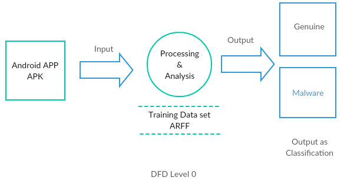
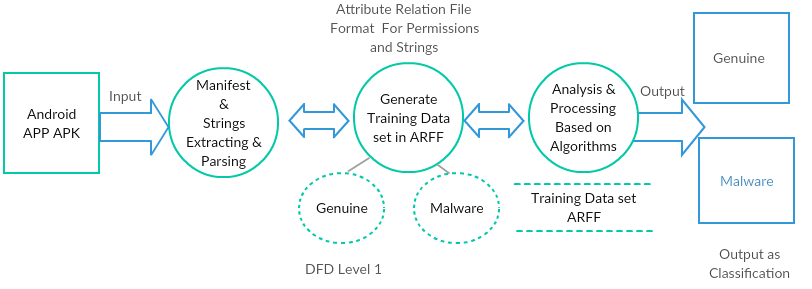

# Android-Malware-Detection

As we know android applications are becoming increasingly because android phones are widespread and steadily gaining popularity. Unfortunately, such phenomenon draws attention to malicious application developers so that malicious applications are increasing rapidly. These malicious applications are capable to stealing sensitive and private user information and to damage the phone hardware as well. Therefore it is highly essential to identify and detect these malicious applications which is present in both official Android Market and alternative application markets.

In this application we extract two features for the Android applications:

 - Permissions extracted from AndroidManifest.xml file
 - Strings extracted from the compiled source code file (dex file)
 - Permissions are the kernel access given to each Android application
   to access core functionalities of the phone hardware
 - We classify these permissions according to their usage by both genuine and malicious applications
 - We also extract the const-string labelled strings from the source
   code of applications
 - Since, source code analysis is used in detection of desktop malware
   We apply the same mechanism to identify and detect Android malware

**Here I have added two projects ,**

 - Desktop Application for android malware detection
 - Android Mobile App to android malware detection

**Data flow Diagram**

 - 

 - 

**Steps To Run Application**

 - [Steps to run netbeans application](https://docs.oracle.com/javase/tutorial/getStarted/cupojava/netbeans.html)

- [Steps to run android application](https://developer.android.com/training/basics/firstapp/running-app.html)
